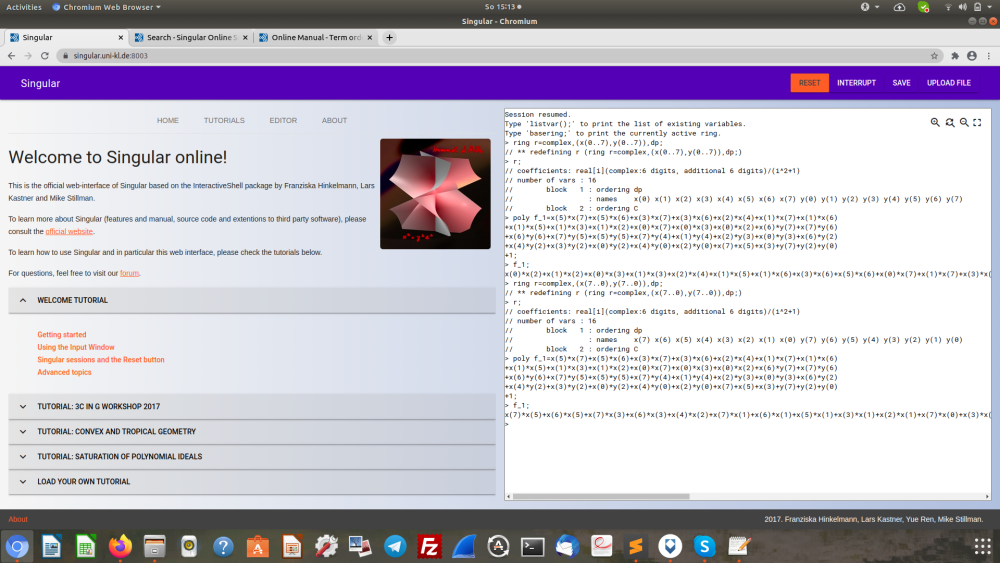

# Computing the Condition Number with Singular

We chose the [Computeralgebra System Singular](https://www.singular.uni-kl.de/) for our first tests to create the Macaulay matrix for the QAA on AES. 


## Polynomials of the AES S-Box

First we created a Singular compatible notation of the 39 Boolean quadratic polynomials for the AES S-Box can be found in the 8 Appendix of original paper: [Boolean quadratic polynomials of the AES S-Box for Singular](AES_polys_Chen_Gao_vars)


## Ring Declaration

We identified the ring declaration in Singular corresponding to the monomial ordering of the Boolean quadratic polynomials in the original paper by testing the monomial ordering of the polynomial f_1(x_7,...,y_0):

``` json
ring r=complex,(x(7..0),y(7..0)),dp;
poly f_1=x(5)*x(7)+x(5)*x(6)+x(3)*x(7)+x(3)*x(6)+x(2)*x(4)+x(1)*x(7)+x(1)*x(6)+x(1)*x(5)+x(1)*x(3)+x(1)*x(2)+x(0)*x(7)+x(0)*x(3)+x(0)*x(2)+x(6)*y(7)+x(7)*y(6)+x(6)*y(6)+x(7)*y(5)+x(5)*y(5)+x(7)*y(4)+x(1)*y(4)+x(2)*y(3)+x(0)*y(3)+x(6)*y(2)+x(4)*y(2)+x(3)*y(2)+x(0)*y(2)+x(4)*y(0)+x(2)*y(0)+x(7)+x(5)+x(3)+y(7)+y(2)+y(0)+1;
poly f_1;
x(7)*x(5)+x(6)*x(5)+x(7)*x(3)+x(6)*x(3)+x(4)*x(2)+x(7)*x(1)+x(6)*x(1)+x(5)*x(1)+x(3)*x(1)+x(2)*x(1)+x(7)*x(0)+x(3)*x(0)+x(2)*x(0)+x(6)*y(7)+x(7)*y(6)+x(6)*y(6)+x(7)*y(5)+x(5)*y(5)+x(7)*y(4)+x(1)*y(4)+x(2)*y(3)+x(0)*y(3)+x(6)*y(2)+x(4)*y(2)+x(3)*y(2)+x(0)*y(2)+x(4)*y(0)+x(2)*y(0)+x(7)+x(5)+x(3)+y(7)+y(2)+y(0)+1
```
* *complex* stands for complex coefficients, 
* *x(7..0)* for the variables x_7, ..., x_0 
* *y(7..0)* for the variables y_7, ..., y_0 
* *dp* stands for degree lexicographical ordering (x_7 > ... x_0 > y_7 > ... > y_0 > 1)

So we are working in the polynomial ring with 16 variables over the complex numbers and the degree lexicographical ordering.

The descending order of variable indexes lead to an order of monomials in the polynomial f_1 which matched the corresponding polynomial in the original paper.

The ascending order of variable indexes lead to a deviation of the polynomial f_1 from the corresponding polynomial in the original paper:

``` json
ring r=complex,(x(0..7),y(0..7)),dp; 
poly f_1=x(5)*x(7)+x(5)*x(6)+x(3)*x(7)+x(3)*x(6)+x(2)*x(4)+x(1)*x(7)+x(1)*x(6)+x(1)*x(5)+x(1)*x(3)+x(1)*x(2)+x(0)*x(7)+x(0)*x(3)+x(0)*x(2)+x(6)*y(7)+x(7)*y(6)+x(6)*y(6)+x(7)*y(5)+x(5)*y(5)+x(7)*y(4)+x(1)*y(4)+x(2)*y(3)+x(0)*y(3)+x(6)*y(2)+x(4)*y(2)+x(3)*y(2)+x(0)*y(2)+x(4)*y(0)+x(2)*y(0)+x(7)+x(5)+x(3)+y(7)+y(2)+y(0)+1;
poly f_1;
x(0)*x(2)+x(1)*x(2)+x(0)*x(3)+x(1)*x(3)+x(2)*x(4)+x(1)*x(5)+x(1)*x(6)+x(3)*x(6)+x(5)*x(6)+x(0)*x(7)+x(1)*x(7)+x(3)*x(7)+x(5)*x(7)+x(2)*y(0)+x(4)*y(0)+x(0)*y(2)+x(3)*y(2)+x(4)*y(2)+x(6)*y(2)+x(0)*y(3)+x(2)*y(3)+x(1)*y(4)+x(7)*y(4)+x(5)*y(5)+x(7)*y(5)+x(6)*y(6)+x(7)*y(6)+x(6)*y(7)+x(3)+x(5)+x(7)+y(0)+y(2)+y(7)+1
```


## Macaulay matrix

Y.-A.Chen, X.-S.Gao  describe in their original paper (https://arxiv.org/abs/1712.06239}, 2018) how the matrix is created from a BMQ of a chosen cryptosystem. 


## Online Singular Tool

Check out the online version of the [Computeralgebra System Singular](https://www.singular.uni-kl.de:8003/) to verify our steps:





